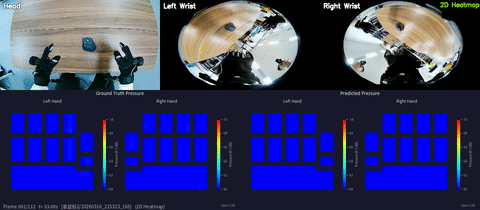
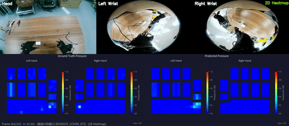

<div align="center">

# TouchAnything

### The First Dataset and Framework for Bimanual Tactile Estimation from Egocentric Video

[](https://jianyi2004.github.io/TouchAnything-Website/)
[](https://arxiv.org/abs/2605.13083)
[](https://huggingface.co/datasets/zhouzhoujy/EgoTouch/tree/main)
[](LICENSE)

**[Jianyi Zhou](https://github.com/Jianyi2004)<sup>1</sup>, Ziteng Gao<sup>1</sup>, Feiyang Hong<sup>1</sup>, Zirui Liu<sup>1</sup>, Guannan Zhang<sup>1</sup>, Weisheng Dai<sup>1</sup>,**  
**Ruichen Zhen<sup>2</sup>, Chuqiao Lyu<sup>3</sup>, Haotian Wu<sup>2</sup>, Yinian Mao<sup>2</sup>, Xushi Wang<sup>1</sup>, Yuxiang Jiang<sup>1</sup>,**  
**Wenbo Ding<sup>3</sup>, [Shuo Yang](mailto:shuoyang@hit.edu.cn)<sup>1✉</sup>**

<sup>1</sup>Harbin Institute of Technology, Shenzhen &nbsp;&nbsp; <sup>2</sup>Meituan Academy of Robotics  
<sup>3</sup>Tsinghua Shenzhen International Graduate School, Tsinghua University

<sup>✉</sup>Corresponding author

---

</div>

## 📢 News

- **[2026-04]** Project website and initial README released
- **[2026-05]** Dataset upload in progress; the currently accessible files may be incomplete until the upload finishes
- **[2026-05]** Code release

## 🎯 Overview

We introduce **EgoTouch**, the first large-scale multi-view tactile dataset for egocentric hand-object interaction, comprising **208 diverse manipulation tasks** across **1,891 episodes** in both indoor and outdoor environments. The dataset provides synchronized multi-view video (egocentric + dual wrist cameras), bimanual 3D hand pose (42 joints), and dense continuous pressure maps from wearable tactile sensors.

Building upon this dataset, we propose **TouchAnything**, a unified multi-view tactile prediction architecture that integrates shared vision encoding, cross-view attention, and view dropout strategy. Our experiments demonstrate that incorporating complementary wrist views is crucial for resolving occluded contact regions and enabling reliable tactile inference under severe occlusions.

## ✨ Key Features

- **🎥 Multi-View Capture**: First dataset combining multi-view synchronized video (egocentric + dual wrist cameras) with real tactile pressure data
- **🖐️ Dense Tactile Sensing**: Real continuous pressure distributions from wearable sensors, capturing fine-grained contact dynamics
- **🤲 Bimanual Interaction**: Bimanual manipulation with 42-joint 3D hand pose annotations, enabling analysis of coordinated hand-object interaction
- **🔄 Synchronized Modalities**: Precise frame-level synchronization across video, pose, and pressure, enabling accurate temporal modeling of contact events

## 📊 Dataset Statistics

| Metric | Value |
|--------|-------|
| **Manipulation Tasks** | 208 |
| **Episodes** | 1,891 |
| **Camera Views** | 3 (Ego + Dual Wrist) |
| **Hand Joints** | 42 (Bimanual) |
| **Total Frames** | ~2M |
| **Objects** | 1,000+ |
| **Environments** | Indoor & Outdoor |

## 🔬 Dataset Comparison

EgoTouch is the first dataset to jointly provide multi-view video, bimanual hand pose, and real dense pressure data across diverse scenes.

| Dataset | In-the-wild | Hand Pose | Contact | Wrist Views | Hands | Objects | Frames |
|---------|-------------|-----------|---------|-------------|-------|---------|--------|
| GRAB | ❌ | MoCap | Analytical | ❌ | Biman. | 51 | 1.6M |
| ContactDB | ❌ | ❌ | Thermal | ❌ | Biman. | 50 | 375k |
| ARCTIC | ❌ | MoCap | Analytical | ❌ | Biman. | 11 | 2.1M |
| OakInk | ❌ | MoCap | Analytical | ❌ | Single | 100 | 230k |
| DexYCB | ❌ | Est. | ❌ | ❌ | Single | 20 | 582k |
| ActionSense | ❌ | Glove | Pressure | ❌ | Biman. | 21 | 521k |
| HOI4D | ❌ | Est. | ❌ | ❌ | Single | 800 | 2.4M |
| EgoPressure | ❌ | Est. | Pressure | ❌ | Single | 31 | 4.3M |
| EgoDex | ❌ | Est. | Analytical | ❌ | Biman. | 500 | 90M |
| OpenTouch | ✅ | Glove | Pressure | ❌ | Single | 800 | ~500k |
| **EgoTouch (Ours)** | ✅ | **Glove + Est.** | **Pressure** | ✅ | **Biman.** | **1000** | **2M** |

## 🏗️ Main Contributions

1. **First large-scale multi-view tactile dataset** for egocentric hand-object interaction, comprising 208 tasks, 1,891 episodes, bimanual pose, and dense continuous pressure maps across diverse indoor and outdoor scenes

2. **First multi-view tactile prediction benchmark**, including evaluation protocols that quantify the role of complementary wrist views and show clear gains under severe occlusion

3. **New multi-view tactile prediction architecture** with shared vision encoding, cross-view attention, and view dropout, enabling flexible inference with any combination of available views

## 🎬 Model Demo

<div align="center">

<table>
<tr>
<td align="center"><b>Grasping Thermos</b><br></td>
<td align="center"><b>Handling Hair Dryer</b><br></td>
</tr>
<tr>
<td align="center"><b>Grasping Beverage</b><br></td>
<td align="center"><b>Picking Up Mouse</b><br></td>
</tr>
<tr>
<td align="center"><b>Bouncing Ping-Pong Ball</b><br></td>
<td align="center"><b>USB Insertion</b><br></td>
</tr>
</table>

</div>

## 🛠️ Data Collection Setup

<div align="center">

</div>

Our data collection system integrates:

- **Head-mounted Wide-Angle Camera**: Captures global manipulation context from a wide-field first-person perspective
- **Dual Wrist Cameras**: Observe hand-object contact regions to overcome occlusion
- **Pressure-Sensing Gloves**: Record dense 16x16 pressure maps on each palm
- **Motion Capture**: Tracks 42-joint bimanual 3D hand pose at 30Hz
- **Temporal Synchronization**: All modalities aligned with millisecond precision

## 🧠 Method Architecture

<div align="center">

</div>

We propose a multi-view tactile prediction model based on:

- **Shared DINOv2 Vision Encoder**: Extracts features from all camera views
- **Learnable View Embeddings**: Distinguishes between egocentric and wrist viewpoints
- **Cross-View Transformer Attention**: Fuses complementary information across views
- **View Dropout Training**: Enables robust inference with missing views

This design allows the model to work with any subset of available views at inference time, from ego-only to full multi-view, making it practical for real-world deployment.

## 📁 Data Format

Each episode is stored as an HDF5 file with the following structure:

```
├── images/
│   ├── chest_color    # (T, 480, 640, 3) egocentric RGB
│   ├── left_color     # (T, 480, 640, 3) left wrist RGB
│   └── right_color    # (T, 480, 640, 3) right wrist RGB
├── hands/
│   ├── wilor_left_joint_xyz   # (T, 21, 3) left hand pose from WiLoR
│   ├── wilor_right_joint_xyz  # (T, 21, 3) right hand pose from WiLoR
│   ├── wilor_left_valid       # (T,) left-hand pose validity mask
│   ├── wilor_right_valid      # (T,) right-hand pose validity mask
│   ├── left_joint_xyz         # (T,) legacy placeholder
│   └── right_joint_xyz        # (T,) legacy placeholder
├── pressure/
│   ├── left_pressure_grid     # (T, 21, 21) normalized [0,1]
│   ├── right_pressure_grid    # (T, 21, 21) normalized [0,1]
│   └── attrs                  # grid_size, separate_normalization, tactile/bend maxima
├── poses/
│   ├── chest_pose     # (T, 7) camera pose [xyz, quat]
│   ├── left_pose      # (T, 7) left wrist camera pose
│   └── right_pose     # (T, 7) right wrist camera pose
├── masks/
│   ├── glove_masks          # (T, N, 480, 640) glove/object masks, N may be 0
│   ├── glove_obj_ids        # (T, N) object ids for mask channels
│   ├── glove_valid_frames   # (T,) mask-valid frame flags
│   └── attrs                # mask availability and object-count metadata
├── metadata/
│   └── attrs                # task_name, trajectory_id, fps, num_frames, camera_resolution, etc.
└── timestamps               # (T,) frame timestamps
```

**T** is the number of frames in the episode. The released HDF5 files use 30 FPS and may contain variable-length trajectories.

## 📦 Installation

Clone the repository and create the conda environment:

```bash
cd /path/to/TouchAnything
conda env create -f environment.yaml
conda activate touchanything
```

The training and inference scripts assume they are launched from the repository root.

## 🎯 Quick Start

### 1. Download the Dataset

Download the EgoTouch dataset from Hugging Face:

```text
https://huggingface.co/datasets/zhouzhoujy/EgoTouch/
```

After extraction, place the raw dataset under the repository dataset directory, for example:

```text
datasets/EgoTouch/
```

### 2. Convert Raw Data to HDF5

Convert the raw dataset into the HDF5 format used by the training and inference pipeline:

```bash
bash scripts/run_convert_to_hdf5.sh
```

The converted dataset is expected to be stored as:

```text
datasets/EgoTouch_hdf5/
```

Move the official split file into the converted HDF5 dataset directory:

```bash
mv datasets/EgoTouch/split.json datasets/EgoTouch_hdf5/split.json
```

### 3. Train

Start distributed training with the default configuration:

```bash
bash scripts/run_train_ddp.sh
```

Training checkpoints will be saved under the checkpoint directory configured by the training script.

### 4. Evaluate

After training finishes, run inference and evaluation:

```bash
bash scripts/run_inference.sh
```

The inference outputs, metrics, and visualization videos will be written to the output directory configured in the script.

## 📧 Contact

For questions or collaboration opportunities, please contact:

- **Shuo Yang** (Corresponding Author): [shuoyang@hit.edu.cn](mailto:shuoyang@hit.edu.cn)
- **Jianyi Zhou**: [GitHub](https://github.com/Jianyi2004)

## 🙏 Acknowledgments

This work represents a collaborative effort across multiple domains, from hardware setup to model development and data collection. We thank all team members for their contributions:

- **Jianyi Zhou**: Paper writing, model architecture design, website development, data collection
- **Ziteng Gao**: Data collection pipeline, experimental equipment management, data collection
- **Feiyang Hong**: Codebase organization, paper figure optimization, data collection
- **Zirui Liu**: Paper figure design and illustration, data collection
- **Guannan Zhang**: Project website video editing, data collection
- **Weisheng Dai**: Experimental equipment management, data collection
- **Ruichen Zhen**: Equipment procurement and hardware configuration
- **Chuqiao Lyu**: Data collection system setup
- **Haotian Wu**: Data collection hardware setup support
- **Yinian Mao**: High-level guidance and project support
- **Xushi Wang**: Wilor inference framework development, data collection
- **Yuxiang Jiang**: Data collection participation
- **Wenbo Ding**: High-level idea discussions
- **Shuo Yang**: Research ideation, project supervision, model design consultation, technical guidance

## 📄 License

This project is licensed under the MIT License - see the [LICENSE](LICENSE) file for details.

---

<div align="center">


[Project Page](https://jianyi2004.github.io/TouchAnything-Website/) | [Paper](https://arxiv.org/abs/2605.13083) | [Dataset](https://hf-mirror.com/datasets/zhouzhoujy/EgoTouch)

</div>
